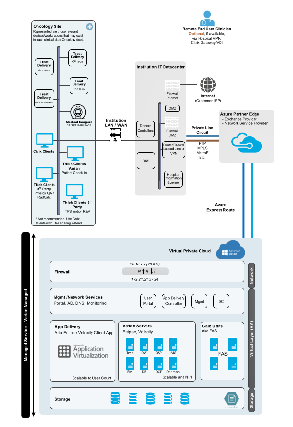

[Back to Module](./../README.md)

# Brief
This team-based project aims to assess students’ understanding of foundational cloud computing concepts, cloud service models, deployment types, and cloud infrastructure design, as introduced in weeks 1-6. The assessment requires each team to collaborate on a report that evaluates a cloud infrastructure framework, focusing on both theoretical understanding and applied design.

#### Coursework Task

In groups of 3-4, students are to select a specific cloud infrastructure framework (e.g., AWS CloudFormation, Microsoft Azure Resource Manager, Google Cloud Deployment Manager) and create a report addressing the following:

- Overview: Briefly describe the chosen cloud framework, highlighting its core features and purpose.
- Service Model Analysis: Explain how the framework supports different cloud service models (e.g., IaaS, PaaS, SaaS).
- Deployment Types: Discuss how the framework can be applied across public, private, and hybrid cloud environments.
- Infrastructure Design: Outline the steps for designing a basic infrastructure using the chosen framework, including key components (compute, storage, networking).
- Case Study or Real-World Example: Provide a real-world example where this framework was used and evaluate its impact on organisational efficiency and cost.

[Submitted Assignment](COM/Assignment1/Azure_ARM_Coursework_Report_Submission_Group_A.pdf)

## My contribution

My personal contribution was to write a case study on how our chosen platform has been used.

### Case Study
Varian Medical Systems, a market leader in Oncology treatment solutions, utilises Azure Cloud to offer their FullScale Infinity Cloud (FSIC) solution (Varian Medical Systems, 2025).  

### Security
Due to the sensitive nature of data held within the products offered by Varian via FSIC, it is considered Infrastructure as a Service (IaaS), therefore the provisioning environment does not require access to or storage of any Protected Health Information or Personally Identifiable Information (PHI/PII) directly.  

In order to protect PHI/PII, FSIC implements a strong Segregation of Duties (SoD) model to ensure that access ti critical infrastructure is tightly controlled, minimising the risk of unauthorised access and ensuring proper security protocols are followed.  

Access is managed as follows: 

- Third Party Contractor Access: 
	- Limited back end access. Third party contractors are granted restricted access solely for the purpose of patching, management and installation within the environment.  
	- Contractors are restricted to specific tasks and have no broader access to other infrastructure outside their area of responsibility. 
- V.I.P.E.R of service password management 
	- “Varian Infrastructure Password with Enforced Rotation” is a Role Based Access Control (RBAC) used to ensure only authorised service personnel can access service accounts connected to the hosted VM’s.  
- Azure Role Based Access Control (RBAC) 
	- Azure RBAC is used to manage and control access to all Azure resources. 
- Customer Access
	- Institution end users are restricted to hosted application-level access. This ensures customers can only perform necessary tasks within their applications while maintaining a secure and isolated environment from the backend systems. 

Further Security measures are the use of "Azure ExpressRoute", whereby data is transmitted via private lines, and not over the "open" internet. 

Azure is the chosen platform for FSIC since the back-up replication is divided into regions according to national borders or geopolitical lines (Borra, 2024). This allows for regulatory compliance, ensuring special category data is processed in accordance with the originating countries laws such as UK GDPR, EU GDPR, HIPPA etc. 

### Business Continuity and Infrastructure support

The unfortunate reality of public sector healthcare is that most decisions are financially driven. This means that true high-availability, on-premises solutions are prohibitively expensive, and often compromise is made. The best case scenario is that hot-standby is compromised for cold-standby DR. In the event of a disaster, this will still result in realistic RTO's in the scale of hours, rather than minutes. For example, at this authors institution, there was a recent incident causing fire suppression to activate in the main on-premises data centre, resulting in approximately six hours of lost clinic time. The particular events surrounding this event (occurring out of hours, faulty UPS, etc.), mean that if this incident occurred at the MS Azure data centre, the impact seen by the customer would have been minimal. 

There are of course limitations cloud infrastructure, as seen by the widely reported issues resulting from the CloudStrike update in 2024 (Kleinman, 2024). Additionally, the Azure Express Route creates a single point of failure, as this was the cause for interruption at the Royal Surrey Hospital in June 2024 (Iveson, 2024). Varian do offer mitigation options to  AER failing, such as VPN access, however these options come at a cost, which is often the compromise made when attempting to find cost savings. 

## References

Borra, P. (2024) ‘Comparison and Analysis of Leading Cloud Service Providers (AWS, Azure and GCP)’, _International Journal of Advanced Research in Engineering and Technology (IJARET)_, 15(3), pp. 266–278. Available at: [https://doi.org/10.2139/ssrn.4914145](https://doi.org/10.2139/ssrn.4914145).

Iveson, H. (2024) _Radiotherapy service update | News_, _Royal Surrey NHS Foundation Trust_. Available at: [https://www.royalsurrey.nhs.uk/news/radiotherapy-service-update-12715](https://www.royalsurrey.nhs.uk/news/radiotherapy-service-update-12715) (Accessed: 24 August 2025).

Kleinman, Z. (2024) _How a single IT update caused global havoc_, _BBC News_. Available at: [https://www.bbc.com/news/articles/cpwdyxx0v64o](https://www.bbc.com/news/articles/cpwdyxx0v64o) (Accessed: 24 August 2025).

Varian Medical Systems (2025) ‘FullScale Infinity Cloud 1.8 Security White Paper’. Available at: [https://www.varian.com/resources-support/cybersecurity-varian](https://www.varian.com/resources-support/cybersecurity-varian) (Accessed: 15 August 2025).
