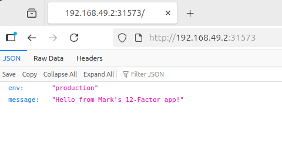

[Back to Module](./README.md)

# Unit 5 Formative Activity

### Brief
Deploy a 12-Factor App using Docker and manage it through Kubernetes. Set up a local Kubernetes cluster using Minikube and deploy a containerised application following the 12-Factor methodology. 

**Deliverable**: Post A step-by-step guide (500 words) explaining how you deployed the 12-Factor app on Kubernetes.

### 1. Assumptions and prerequisites

1. Docker Engine is installed
2. Kubctl is installed
3. Minikube is installed

### 2. Prepare App, dockerfile and requirements

Within the root directory of repository being used, create a simple [app](./Unit5/app.py), [requirements](./Unit5/requirements.txt), [Dockerfile](./Unit5/Dockerfile), [deployment file](./Unit5/deployment.yaml), [Service file](./Unit5/service.yaml) and [dockerignore file](./Unit5/.dockerignore).

### 3. Start Minikube
From command line:

``` bash
minikube start --driver=docker --cpus=2 --memory=4096
```

### 4. Build image to allow Kubernetes to use it

``` bash
eval $(minikube -p minikube docker-env)
docker build -t myapp:1.0 .
```

### 5. Create ConfigMap / Secrets

``` bash
kubectl create configmap myapp-config --from-literal=ENV=production
kubectl create secret generic myapp-secret --from-literal=DB_URL='postgres://...'
```

### 6. deploy and verify

``` bash
kubectl apply -f deployment.yaml -f service.yaml
kubectl get pods --watch
kubectl get svc
kubectl logs -l app=myapp -f
```
Find url to view in browser
```bash
minikube service myapp-service --url
```



### 7. Demonstrate scalability
``` bash
kubectl scale deployment myapp --replicas=3
kubectl run -rm -it admin --image=myapp:1.0 --restart=never --bash
kubectl delete pod <pod-name>
```
### 8. Cleanup
``` bash
kubectl delete -f deployment.yaml -f service.yaml
minikube stop
minikube delete
```

