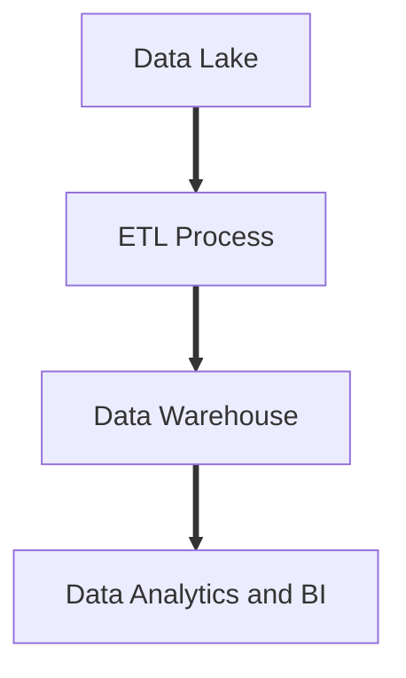
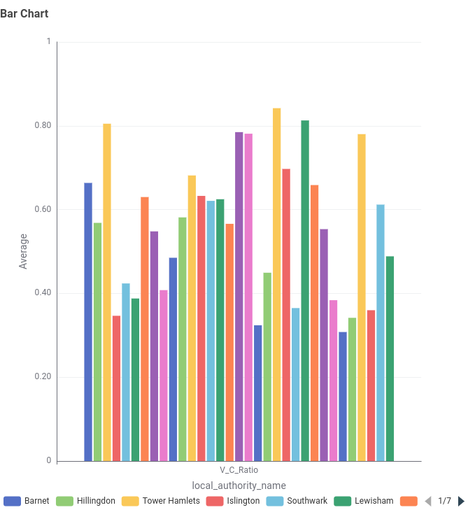
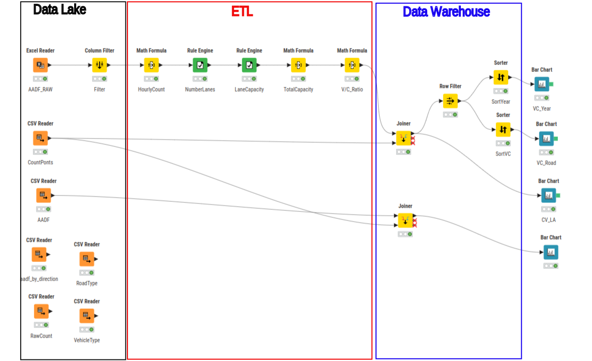

# Implementation Report

## Introduction

The Data Architecture described in Collins (2025) is that of a multi-level architecture, consisting of a Data Lake for data ingestion and cleaning, a Data Warehouse hosting a number of key queries, feeding into an analytics layer for reporting and consumption of the data.

Using the KNIME platform (KNIME AG, 2024) a simplified version of this Architecture has been developed.

## Architecture Overview


**Figure 2:1:** _Data Architecture overview_

The sequential flow of data through the Data Architecture involves raw data landing in the Data Lake. A number of Extract Transform Load (ETL) processes are performed landing in the Data Warehouse, ready for consumption for Data Analytics and Business Intelligence (BI) reporting. 

## Data Lake and Data Ingestion

The Data Lake acts as a landing zone for the data. Allowing the data to remain in its original raw format within the landing zone of the Data Lake allows for good data governance. All ETL processes can be reproduced, and the the original data is unaffected allowing any decisions made to be traced to the original raw data. 

Within the Data Lake, the data can go through an initial cleansing into a staged zone (Ramchand and Mahmood, 2022). This is useful if the data being ingested is coming in multiple formats. The data can be converted into a format that will allow more efficient processing later. 


## ETL processes

Within the Extract Transform and Load processes, certain calculations and further filtering can be be performed. For example Volume-Capacity Ratios are used an an indicator of congestion [@noland2005]. This can be calculated by
1. Process the Average Annual Daily Flow (AADF) data within the Data Lake to filter out superfluous columns, leaving:
```
$count_point_id$
$road_catagory$
$road_type$
$estimation_method$ <> "Estimate"
$all_motor_vehichles$
$year$
```
2. Convert daily counts to hourly: `$all_motor_vehicles$ / 24`
3. Estimate the number of lanes for each road type:
```
$road_category$ = "MB" => 1  # Minor B Road
$road_category$ = "MCU" => 1 # Minor Urban
$road_category$ = "PA" => 2  # Primary A Road
$road_category$ = "TA" => 2  # Trunk A Road
$road_category$ = "TM" => 3  # Motorway
```

4. Estimate the Capacity per lane (Makki et al., 2020):
```
$road_category$ = "MB" => 1000
$road_category$ = "MCU" => 1000
$road_category$ = "PA" => 1000
$road_category$ = "TA" => 1000
$road_category$ = "TM" => 2000
```
5. Calculate total road capacity: `$CapacityPerLane$ * $NumLanes$`
6. Calculate Volume-Capacity Ratio: `$VolumePerHour$ / $TotalCapacity$`
7. Join With Count Point data table so V/C ratio can be assigned to location information. 
8. Load the data into the Data Warehouse ready for consumption. 

# Data Warehouse
Final queries from the ETL process land in the Data Warehouse. Here the data is stored in a cleaned and curated format. In an enterprise environment, this would be a fast access storage medium, with sufficient processing and memory requirements to access the data without delay, and without impacting the ETL process earlier in the data journey.  

## Analytics and Business Intelligence

The contents of the Data Warehouse is readily available for further analysis and reporting. For example the Average V/C Ratio can be plotted by Local Authority to show the Authority with the highest congestion rates. 
Figure 2:2 shows that the local Authority with the highest average V/C Ratio is Hammersmith and Fulham, with a V/C of 0.842.


**Figure 2:2:** _Bar chart showing average V/C per Local Authority_

With the data held within the Data Warehouse, Local Authority can be filtered to only look at this Local Authority, and display by both an average over the Local Authority by year, to look at over-all changes, or by street to find particular roads and junctions driving up the congestion. 


**Figure 2:3:** _A4 is the most congested road in the Hammersmith and Fulham Authority_

## Conclusion


**Figure 2:4:** _Visual representation of Data Architecture and data flow using KNIME_

A Data Architecture has been developed and implemented using KNIME (KNIME AG, 2024) to manage and analyse the data provided by the Department for Transport covering Road Traffic Statistics in the London Region (Department for Transport, 2023).

The data lake acts as a landing zone for all data, regardless of source, whether this be manual CSV or Excel tables, JSON data, IOT sensors, or API's to other data sources. 

The data is then partially cleaned within the Data Lake before undergoing Extraction, Transformation and then Loading into the Data Warehouse. 

The Data Warehouse contains the curated data, ready for ingestion by the Analytics / BI layer where decision makers can easily view and interoperate the data.

## Further work and Recommendations

The data Architecture has been created using only the DfT data for the London region. Given the flexibility of the Data Lake, Weather, or Event data can be fed in to measure the impact of these on traffic flow. 

Further, Accident data (Transport for London, no date) can be loaded into the data lake to observe where traffic calming measures and Cycle infrastructure can be implemented.

# References

Collins, M. (2025) _Enterprise Data Report - Case Analysis_. University of Essex.

Department for Transport (2023) _Road traffic statistics - London region_. Available at: [https://roadtraffic.dft.gov.uk/regions/6](https://roadtraffic.dft.gov.uk/regions/6) (Accessed: 4 June 2025).

KNIME AG (2024) _KNIME Analytics Platform_. Available at: [https://www.knime.com/](https://www.knime.com/).

Makki, A.A. _et al._ (2020) ‘Estimating Road Traffic Capacity’, _IEEE Access_, 8, pp. 228525–228547. Available at: [https://doi.org/10.1109/access.2020.3040276](https://doi.org/10.1109/access.2020.3040276).

Noland, R.B. and Quddus, M.A. (2005) ‘Congestion and safety: A spatial analysis of London’, _Transportation Research Part A: Policy and Practice_, 39(7), pp. 737–754. Available at: [https://doi.org/10.1016/j.tra.2005.02.022](https://doi.org/10.1016/j.tra.2005.02.022).

Ramchand, S. and Mahmood, T. (2022) ‘Big data architectures for data lakes: A systematic literature review’, _2022 IEEE 46th Annual Computers, Software, and Applications Conference (COMPSAC)_, pp. 1141–1146. Available at: [https://doi.org/10.1109/COMPSAC54236.2022.00179](https://doi.org/10.1109/COMPSAC54236.2022.00179).

Transport for London (no date) _Road safety data_, _Transport for London | Every Journey Matters_. Available at: [https://www.tfl.gov.uk/corporate/publications-and-reports/road-safety](https://www.tfl.gov.uk/corporate/publications-and-reports/road-safety) (Accessed: 8 July 2025).