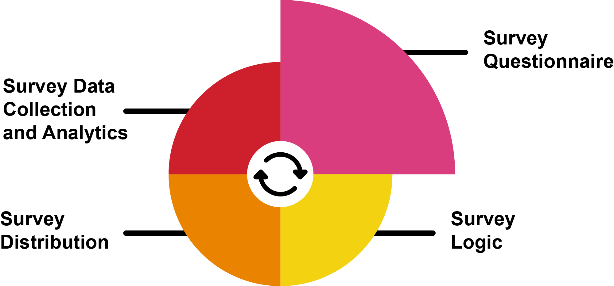

[Back to Module overview](../README.md)

# Unit 5: Interviews, Survey Methods, and Questionnaire Design

Conducting in-depth interviews is one of the most common qualitative research methods. It is a conversational piece, involving only respondent at a time. It provides opportunities for the researcher to get in depth details from the respondent.

A survey is one of the most important quantitative methods of collecting data. There are various types of surveys or polls, and they are used to explore opinions, trends, etc. Online surveys are more generally used, with easier accessibility for the target respondents.

We also need to point out an important difference, the one between a questionnaire and a survey. A survey is a comprehensive method used for the gathering and analysis of data and will involve a questionnaire. A questionnaire on the other hand, just refers to the set of questions with answer choices which is used to conduct a survey.

Image description: The figure below show how the surveying process is cyclic in nature. It starts with a survey questionnaire that leads to survey logic. In turn, this leads to survey distribution, and subsequently survey data collection and analytics.

So, a questionnaire is a valuable research instrument as it offers a researcher flexibility in gaining information from respondents, like a written interview. It can be carried out online, over the phone or face-to-face.

The type of questions you use (open or closed, or both) will depend on whether you are carrying out quantitative or qualitative research, or mixed method). Some questionnaires are better than others and mistakes are easy to make, especially when you are working in a technical area.

All those methods are often used in research, but not always well. Often, they are used together to gain further insight into specific area of the investigation.

We will also introduce pre-testing and post-testing methods which can be used with any of the research methods you have seen. They present a viable “before-and-after” picture of the implementation of a new process or system.

## Formative Activities

1. [Case Study: Inappropriate Use of Surveys](./SurveyCase.md)
2. [Wiki Activity: Questionnaires](./WikiPost.md)
