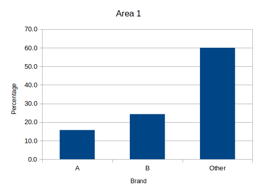
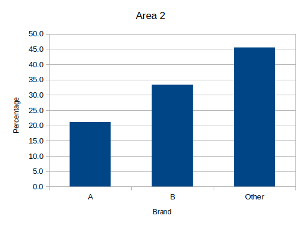
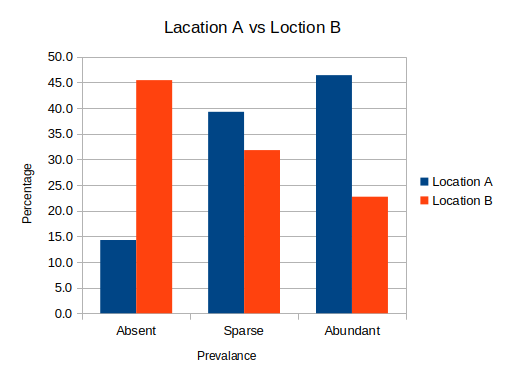
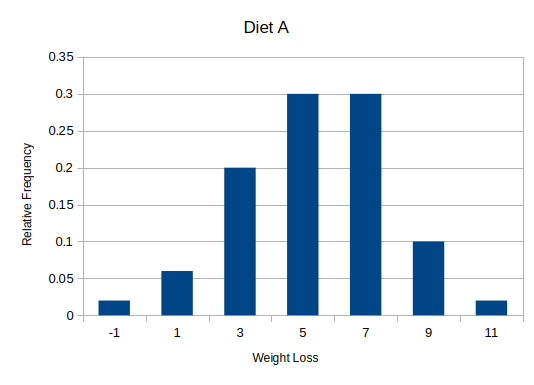
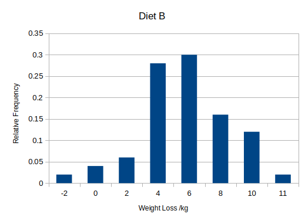

[Back to Unit](./Unit8.md)

# Bar Charts in LibreOffice
## Example 8.4
Consider Data Set D Brandprefs (see the Data Annexe). We produce a percentage frequency bar chart for the breakfast cereal brand preferences for demographic Area 1. 
1. Open the Excel workbook Exa 8.1D.xlsx from the Examples folder. This contains the relevant data, together with the frequency and percentage frequency distributions. 
2. Highlight the cells containing the Brands and percentage frequencies (D15:E17). 
3. From the Insert menu bar tab, select the Charts group. We are going the use the top one – the Column chart. 
4. A bar chart will appear along with a Chart wizard. Looking at the options down the left hand side, when you click on Data Range it will show the data you have highlighted to produce the chart; Data series gives options for labels; Chart elements allows you to give it a title. 
5. The x-axis title will be Brand, the y-axis will be Percentage and the title of the Chart title will be Area 1. 
6. When you double click on the chart a number of options appear in the tool bar at the top. It is worth exploring what each of these can do. There is also a drop-down menu for various aspects of the chart. As you choose the different options here then the range of options changes across the toolbar. 
7. You can select the legend and delete it or you can say no legend using one of the options along the toolbar. As we have only one data series, we do not require a legend. 
8. Click anywhere near the edge of the chart area to select the chart. Drag the chart so that it’s top left-hand corner in cell G3. Click on the chart and drag the handle at the lower right corner to cell N25, hence re-sizing the chart. Click back in the worksheet to de-select the chart. 



### Excercise
Open the Excel workbook in Exe 8.1D.xlsx from the Exercises folder. This contains the percentage frequencies together with the bar chart just created in the above example. Add a percentage frequency bar chart showing the brand preferences in Area 2, using the same format as that employed for the Area1 results in the above example. Drag your new chart so that it lies alongside that for Area 1. It will be easier if you create a separate table that just includes the values of Area 2. 

Briefly interpret your findings. What do these results tell you about the patterns of brand preferences for each of the two demographic areas? 

#### Results



The bar chart shows that Brand A is also least preferred in Area 2, but the differences between each brand is less than in Area 1. 

## Example 8.5

Consider again Data Set D Brandprefs (see the Data Annexe). We produce a percentage frequency clustered column bar chart for the breakfast cereal brand preferences for the two demographic Areas 1 and 2. 
1. Open the Excel workbook Exa 8.2D.xlsx from the Examples folder. This contains the relevant data, together with the frequency and percentage frequency distributions. 
2. Highlight the cells containing the Areas, Brands, and percentage frequencies (D14:F17). 
3. From the Insert menu bar tab, select the Column icon from the Charts group. Select the first chart on the first row – the “clustered column” chart. 
4. The bar chart will appear. Edit the title by typing “Area 1 vs Area 2” into the Title box. 
5. Label the x axis Brand and the y axis Percentage as before. 
6. Click anywhere near the edge of the chart area to select the chart. Drag the chart so that it’s top left-hand corner in cell H3. Click on the chart and drag the handle at the lower right corner to cell O25, hence re-sizing the chart. Click back in the worksheet to de-select the chart. 
  
Your completed chart should resemble that in the figure below: 


### Excercise

Open the Excel workbook in Exe 8.2E.xlsx from the Exercises folder. This contains the frequency distributions for Data Set E Heather (see the Data Annexe) to which has been added the corresponding percentage frequency distributions. Complete a percentage frequency clustered column bar chart showing the heather species prevalence in the two different locations. Briefly interpret your findings. 

#### Results


The chart showsthat Heather is absent in location A is highly Abundant, however Location B is Highly Absent. 

## Histogram - Example 8.6
Consider the dietary data contained in Data Set B Diets (see the Data Annexe). We construct a relative frequency histogram for the weight losses of those individuals who underwent Diet A. 
1. Open the Excel workbook Exa 8.3B.xlsx from the Examples folder. This contains the relevant data, together with the summary statistics obtained previously and an added text template. 
2. Before constructing our histogram, we need to inspect the sample minimum, sample maximum and sample range for the Diet A data. This will inform our choice of classes. Thus, in cell F7, enter the formula =MIN(B2:B51). In cell F8, enter the formula =MAX(B2:B51), and in cell F9, enter the formula =F8-F7. Centre these cells for neatness, and if necessary, round them to three decimal places. 

Now, our sample range is just about 12. This will give either four classes each of width 3 (too few) or six classes of width 2. So, we’ll use six classes each of width 2. 

Since the sample minimum is -1.715 and the sample maximum is 10.062, we’ll start at -2, that is, with the class (-2 ,0]. The remaining classes are therefore (0, 2], (2, 4]…, (10,12]. Notice that the last class must go up to 12 so that we capture the largest observation (the sample maximum of 10.062). In fact, we now have seven classes. 

To construct a frequency distribution, LibreOffice needs to be told our upper-class boundaries. 
 
1. Enter the upper-class boundaries of 0, 2, 4…, 12 in the respective cells H4 to H10 (under the heading UCB) and centre these cells for neatness. 
 
We now use the Excel array function FREQUENCY to obtain the various class frequencies. An array function assigns values to a range of cells simultaneously, so there are special rules governing how to set up such a function. 

2. Select the cell range I4 to I10 (under the heading Frequency). This is where we want to define our array function. With these cells still selected, click fx at the top of the screen. 
3. Now search for the array formula Frequency and then choose this – it will appear in the box at the bottom. Click Next. Then enter the data range (B2:B51,H4:H10) alongside Frequency in the box. The first range in this formula tells Excel where the relevant data are, whilst the second range tells Excel where the required upper-class boundaries are. The click OK. 
 
In order to obtain a relative frequency distribution, we’ll need to know the total number of observations. But we already know this – it’s the sample size n in cell F3. However, just as a check, we’ll add up the various class frequencies. 
    
4. In cell H11 type: Total, and in cell I11 enter the formula =SUM(I4:I10). Centre and embolden these cells. The total number of observations should check out as 50. 
 
Now, to ensure that our histogram bars will meet at the class boundaries, each must be plotted at the corresponding class mark – the mid-point of each class. This can be obtained by simply averaging the upper- and lower-class boundaries. 
Thus, for the class 

``` 
(-2, 0] the class mark is (-2 + 0)/2 = -1 
 
(0, 2] the class mark is (0 + 2)/2 = 1 
 
(2, 4] the class mark is (2 + 4)/2 = 3 
 ```
 
and so on. The class marks increase by 2 each time. 
 
5. Enter the class marks of -1, 1, 3…, 11 in the respective cells K4 to K10 (under the heading Class Mark) and centre these cells for neatness. 
 
We now enter the various relative frequencies (proportions of observations) into the cells L4 to L10 (under the heading Relative Frequency). 

6. In cell L4, enter the formula =I4/I$11. Copy and paste this cell into the cells L5:L10. Format the cells L4:L10 to two decimal places. As a check on calculations, copy and paste cells H11:I11 into K11:L11. As anticipated, the total relative frequency is 1 (all the observations have been accounted for). 
 
We now construct a simple bar chart, plotting the relative frequencies against the class marks, following the procedure outlined in previously. This will constitute our histogram. 

7. Highlight the cells containing the relative frequencies, L4:L10. Select the Insert menu bar tab, choose Column from the Charts group then select the first chart on the first row – the “clustered column” chart. 
8. Unfortunately, in LibreOffice there is no option for a bar chart with no gaps as there is in Excel (also neither actually will produce a histogram) so we will have to imagine there is no gap between the bars, but we can get a good impression of the shape of the data from this. 
9. Label the x axis Weight Loss (kg) and the y axis Relative frequency. 
10. The Chart Title is "Diet A". 
11. Drag the chart so that its top left-hand corner is in cell D13. Click on the chart and drag the handle at the lower right corner to cell K35, hence re-sizing the chart. 

Your completed histogram should resemble that in the figure below: 
 
 

For those individuals who underwent diet A, the weight loss distribution is unimodal and symmetrical, with perhaps a hint of negative skewness. 

As before, you might again want to further customise your chart. For example, right click on the vertical axis and select Format Axis and then Number to reformat the axis numbering to display exactly two decimal places. 

### Excercise

Open the Excel workbook in Exe 8.3B.xlsx from the Exercises folder. This contains the relative frequency histogram for the Diet A weight loss produced in Example 8.3 together with some of the Diet B weight loss summary statistics. Add a relative frequency histogram of the weight loss for Diet B, where possible using the same classes as those employed for the Diet A results in the above example. 
Briefly interpret your histogram. What do these results tell you about the patterns of weight loss for each of the two diets? 

#### Results



Diet B shows a slightly positively skewed distribution, however the majority of results are very close to the mean, with low number in the outer tails. 