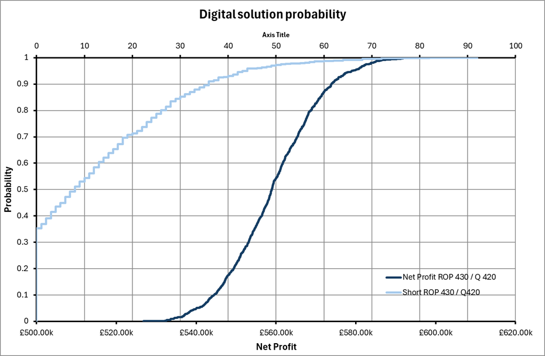
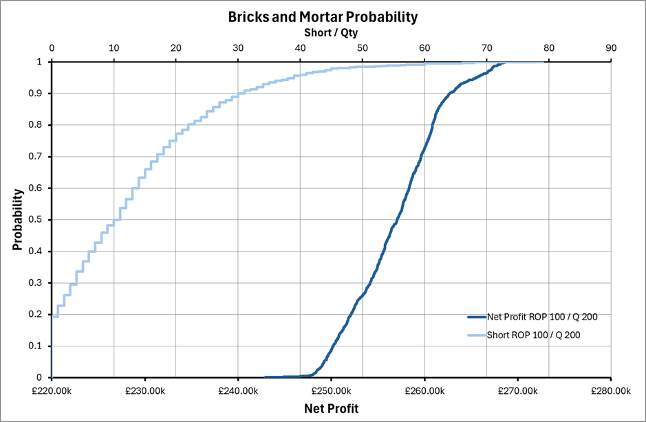
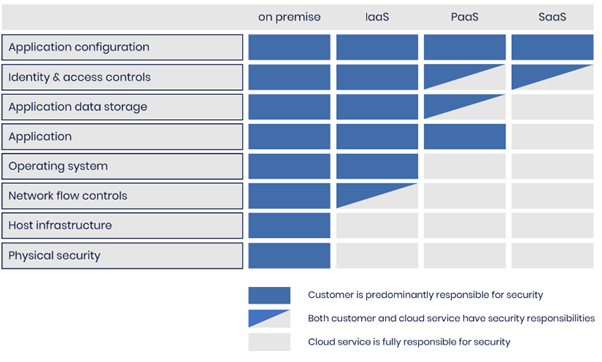

# Pampered Pets Supply Chain risks and e-commerce mitigations

**Mark Collins** *MC24952@essex.ac.uk*

**Word Count:** 1804

Mark Collins [MC24952@essex.ac.uk](mailto:MC24952@essex.ac.uk)

**Word Count: 1804**

## Executive Summary

Pampered Pets has decided to adopt a digitisation process and launch an e-commerce solution. It also desires to reduce production costs and develop an international supply chain.

### Supply chain risks

When changing elements of the supply chain, there are always associated risks. Two scenarios are considered – a _normalised_ as-is scenario with a “Bricks-and-Mortar” shop, and an extreme “Digitised” scenario. Using YASAI (Eckstein & Riedmueller, 2002), and following the methodology outlined in Chapter 5 of Olson & Wu, (2020), a Monte Carlo simulation has been run to estimate the risks associated with proposed changes.

#### Parameters and Assumptions

The following assumptions have been made to model the business changes:

- **Product Quality Control**
  - It is assumed that product Quality Control (QC) remains high, and the actual quality of the product is not compromised in any way.
- **Sale Price**
  - The product cost to the customer is normalised to be (£)100.
- **Purchase Price**
  - Profit Margins for the petfood industry range from 40% to 70% (ERPLY, 2024).
  - Changes to the supply chain are driven by cheaper raw materials.
  - Extremes of this range are assumed.
  - 30% margin for as-is Bricks-and-Mortar shop.
  - 70% margin for digital e-commerce.
- **Order cost**
  - This has been normalised to (£)100 for the Bricks-and-Mortar scenario.
  - Given the increased shipping costs, and increased QC with expected increased failure rates, the worst-case scenario has been assumed of ten times the Bricks-and-Mortar scenario (£1,000).
- **Demand**
  - For the Bricks-and-Mortar scenario, this is normalised to a mean of 100 units per day with a standard deviation of 10, following a normal distribution.
  - As previously stated in the previous risk assessment, the online share of the pet food market is expected to grow to 6.6% (Shahbandeh, 2024). Both mean demand and standard deviation have been increased by 6.6%.
- **Delivery Time**
  - With local suppliers, the store staff can collect the same day, therefore a delivery lag time of 1 day is assumed.
  - With international suppliers, the delivery time will increase. To assume a worst case, delivery time would be five days. Therefore, when calculating stock quantity at the beginning of each day, the ordered quantity will be added to not the next day, but five days later.
- **Hold Cost**
  - Is assumed to be the same for both at 0.8.
- **Shortage**
  - In the Bricks-and-Morter scenario, the stock shortage is considered lost sales, however, in a digital e-commerce scenario, stock can be shipped once the stock has been replenished.
  - For the digital scenario only, any shortage, is added to the following days' demand.
- **Time Period**
  - An increased time was chosen to allow for issues involving longer delivery time to average out.
  - one financial quarter or 90 days was chosen.
- **Re-order Point (ROP)**
  - A range of ROP’s were chosen to model the best mitigation to supply chain risks.
  - Multiple simulations were run to find the “sweet spot” for maximum profit and minimum shortages.
- **Order Quantity (Q)**
  - A range of ROP’s were chosen to model the best mitigation to supply chain risks.
  - Multiple simulations were run to find the “sweet spot” for maximum profit and minimum shortages.

#### Results

For the as-is, Bricks-and-Mortar scenario, net profit is shown in Table 1and Shortages are shown in Table 2, with the highest Profits highlighted.

The same is shown for the Digital scenario in Table 3 and Table 4

Table 1 : Net Profit for Bricks-and-Mortar Scenario

|  || || || || 
|---|---|---|---|---|---|---|---|
|**ROP\Q** | **150** | **160** | **170** | **180** | **190** | **200** |
| **80** | £253,712 | £254,112 | £254,449 | £254,198 | £254,277 | **_£257,663_** |
| **90** | £255,007 | £255,435 | £255,958 | £256,169 | £256,251 | **_£257,705_** |
| **100** | £254,889 | £255,086 | £255,687 | £255,892 | £256,099 | **_£256,835_** |
| **110** | £253,935 | £254,203 | £254,548 | £254,792 | £254,922 | £255,316 |
| **120** | £252,339 | £252,897 | £253,220 | £253,304 | £253,784 | £253,642 |
| **130** | £251,120 | £251,606 | £251,762 | £252,105 | £252,461 | £252,261 |

Table 2 : Total shortage for Bricks-and-Mortar Scenario

|  || || || || 
|---|---|---|---|---|---|---|---|
|**ROP\Q** | **150** | **160** | **170** | **180** | **190** | **200**| 
| **80** | 136 | 130 | 140 | 180 | 218 | 84  |
| **90** | 59  | 50  | 48  | 50  | 60  | 48  |
| **100** | 15  | 13  | 12  | 12  | 12  | 13  |
| **110** | 2   | 2   | 2   | 2   | 2   | 2   |
| **120** | **_0_** | **_0_** | **_0_** | **_0_** | **_0_** | **_0_** |
| **130** | **_0_** | **_0_** | **_0_** | **_0_** | **_0_** | **_0_** |

Table : Net Profit for Digital Scenario

|  || || || || 
|---|---|---|---|---|---|---|---|
|**ROP\Q** |  **370** | **380** | **390** | **400** | **410** | **420** |
| 390 | £563,296 | £581,486 | **_£585,118_** | £576,626 | £568,466 | £561,707 |
| 400 | £561,771 | £579,819 | **_£584,438_** | £576,130 | £567,721 | £560,892 |
| 410 | £560,338 | £578,231 | **_£583,802_** | £575,395 | £567,171 | £560,148 |
| 420 | £558,991 | £576,499 | £582,859 | £574,828 | £566,772 | £559,824 |
| 430 | £557,990 | £574,905 | £582,240 | £574,270 | £566,019 | £559,195 |
| 440 | £557,660 | £573,268 | £581,470 | £573,334 | £565,399 | £558,701 |

Table : Total shortage for Digital Solution

|  || || || || 
|---|---|---|---|---|---|---|---|
|**ROP\Q** | **370** | **380** | **390** | **400** | **410** | **420** |
| **390** | 90  | 75  | 66  | 55  | 48  | 42  |
| **400** | 76  | 63  | 55  | 44  | 36  | 30  |
| **410** | 68  | 56  | 47  | 37  | 28  | 22  |
| **420** | 61  | 50  | 41  | 31  | 23  | 16  |
| **430** | 58  | 47  | 38  | 28  | 20  | 13  |
| **440** | 56  | 46  | 36  | 26  | 18  | 12  |

When maximising profit for the Bricks-and-Mortar scenario, whilst also trying to minimise the shortages, the optimum solution appears to be an ROP of 100 and a Q of 200. This results in a mean shortage of 13 units over the quarter. Taking the same shortage from Table 4, the cumulative probability can be plotted (Figure 1).

Here we can see there is a 60% chance of a shortage of 13 units or less over the quarter and a 50% chance of a profit of at least (£)559k. This is at least double the profit of the Bricks-and-Mortar with the same probability of shortage (Figure 2).

Figure 1: Cumulative probability of Profit and shortage for Digital scenario with ROP of 430 and Q of 420

Figure 2: Cumulative probability of profit and shortage for Bricks-and-Mortar scenario with ROP of 100 and Q of 200

#### Conclusion

Due to the increased delivery time, the ROP and Quantity need to be adjusted to be much higher than the Bricks-and-Mortar scenario, however, due to the increased profit margin from 30% to 70% means the profit is doubled with no compromise to the supply chain and average stock shortages.

A shortage in the Digital scenario is also not a true shortage, and sales are not lost, only delayed, meaning a higher shortage could be tolerated for a higher net profit.

Additional Monte Carlo simulations can be run for varying profit margins and Order Costs when evaluating different suppliers. The simulation shown here is an extreme example, and the reality is likely somewhere between.

It is recommended that when switching to an e-commerce solution with international suppliers, the ROP and Q are increased to allow for longer delivery times.

### Disaster Recovery and Business Continuity

#### Cloud Architecture

When considering the architecture used to host the e-commerce platform, the secure design principles provided by the National Cyber Security Centre can be used (National Cyber Security Centre, 2019).

**Principle 1: Establish context**

The data stored contains sensitive customer data, leading to the threat of fraud. Given the high profile of some of the customers, there is also the threat to personal safety.

Customer information included name, address and payment details. There is clear legal basis for holding this information under GDPR (Council of the European Parliament, 2016).

Clear and strong governance should be in place, minimising any additional information, and clear opt-out for any long-term storage of data (e.g. an option to “check-out as guest”). Additionally, shared responsibility should be clear. Figure 3 shows the shared responsibility models for cloud platforms (National Cyber Security Centre, 2022). Software as a Service increases the risks related to vendor lock-in. Infrastructure as a Service places too much risk ownership on the organisation. A Platform as a Service is a good compromise of risk ownership.

**Principle 2: Make compromise difficult**

Administration of any system should require secure authorisation, implementing multi-factor authentication as a minimum.

Any additional software or systems employed, such as the secure payment method, should be able to provide evidence of compliance with relevant security standards. The compliance and validity of any credentials should be regularly audited, and in-depth due diligence should be performed.

**Principle 3: Make disruption difficult**

Using cloud-based services allows for scalability, ensuring disruption is not caused by infrastructure capacity limitations.

An active-active solution will ensure disruption is minimal in the event of a failure. A multi-cloud strategy (Sekar, 2023) can also be implemented. This mitigates the risks of a single supplier being the cause of an outage, such as the recent CloudStrike incident (Por et al., 2024).

**Principle 4: Make compromise detection easier**

A shared central database (with its own replication) should be employed by a third provider or implemented completely independently of the application databases if stored in one of the original providers.

A regular Chksum should be performed using hash keys and other data integrity tools for all data synchronisations. Any Chksum failures will quickly identify any compromise in data quality, validity or security.

**Principle 5: Reduce the impact of compromise**

A high availability RPO and RTO of one minute each has been requested. The best way to ensure this is to implement two cloud providers, running simultaneously, with a load balancer directing traffic to both providers and synchronizing shared data between the providers. This will allow essentially zero downtime, as there is always a live system available accepting traffic.

In addition, to the multi-cloud solution, each cloud provider can be configured to allow active-active high availability systems, operating from multiple geographic availably zones. Returning to Principle 2, due diligence should be performed to ensure the cloud provider does not store any data in a geographic location not permitted by GDPR. The main cloud providers are generally GDPR compliant (Microsoft Azure, 2018; Woolf, 2018).

The proposed architecture is shown in Figure 4. Here the two “front-end” cloud providers are Microsoft Azure, and Amazon Web Services (AWS), with the shared database hosted by IBM.

****

Figure : Shared responsibility for cloud platforms

Figure : Proposed High Availability, multi-cloud solution.

## Final Conclusions and recommendations

Making any change to business practices results in risk. The level of acceptable risk is the decision of the risk owner.

Adopting an international supplier to reduce purchase costs and increase profit, will ultimately delay delivery, and will need to be offset by the increased reorder point and quantity ordered. That said, adjusting ROP and Q to be of a similar level to existing practices, still yields a net profit of over double.

Additionally, a stock shortage does not result in lost sales for an e-commerce set-up, only a delay, meaning the risk to the business is minimal.

When setting up the e-commerce platform, and digitising the business, to achieve an RPO and RTO of less than a minute, then a high-availability solution is required, running on multiple live cloud platforms and a shared isolated database.

Following the design principles outlined by the National Cyber Security Centre (National Cyber Security Centre, 2019), the security of the system can be maximised, ensuring risk to the organisation and customers is minimised.

# References

Council of the European Parliament. (2016) Regulation (EU) 2016/679 (General Data Protection Regulations). _Official Journal of the European Union_. <https://gdpr-info.eu/>

Eckstein, J., & Riedmueller, S. T. (2002) YASAI: Yet Another Add-in for Teaching Elementary Monte Carlo Simulation in Excel. _INFORMS Transactions on Education_, 2(2): 12–26. DOI: <https://doi.org/10.1287/ited.2.2.12>

ERPLY. (2024) Pros And Cons Of Starting A Pet Supplies Business. Available from: <https://erply.com/pros-and-cons-of-starting-a-pet-supplies-business> \[Accessed 12 October 2024\]

Microsoft Azure. (2018) Protecting privacy in Microsoft Azure: GDPR, Azure Policy Updates. Available from: <https://azure.microsoft.com/en-us/blog/protecting-privacy-in-microsoft-azure-gdpr-azure-policy-updates/> \[Accessed 12 October 2024\]

National Cyber Security Centre. (2019) Secure design principles - Guides for the design of cyber secure systems. Available from: <https://www.ncsc.gov.uk/collection/cyber-security-design-principles> \[Accessed 12 October 2024\]

National Cyber Security Centre. (2022) Cloud security guidance. Available from: <https://www.ncsc.gov.uk/collection/cloud/understanding-cloud-services/cloud-security-shared-responsibility-model> \[Accessed 12 October 2024\]

Olson, D. L., & Wu, D. (2020) _Enterprise Risk Management Models._ 3rd ed. Berlin: Springer Nature. DOI: <https://doi.org/https://doi.org/10.1007/978-3-662-60608-7>

Por, L. Y., Dai, Z., Leem, S. J., Chen, Y., Yang, J., Binbeshr, F., Phan, K. Y., & Ku, C. S. (2024) A Systematic Literature Review on the Methods and Challenges in Detecting Zero-Day Attacks: Insights from the Recent CrowdStrike Incident. _IEEE Access_, 12(September): 144150–144163. DOI: <https://doi.org/10.1109/ACCESS.2024.3455410>

Sekar, J. (2023) Multi-Cloud Strategies for Distributed AI Workflows and Application. _Journal of Emerging Technologies and Innovative Research_, 10(5): 600–610.

Shahbandeh, M. (2024) _Pet food market in the UK - statistics & facts_. Statistica. Available from: <https://www.statista.com/topics/10264/pet-food-market-in-the-uk/#topicOverview> \[Accessed 1 September 2024\]

Woolf, C. (2018) _All AWS Services GDPR ready_. Available from: <https://aws.amazon.com/blogs/security/all-aws-services-gdpr-ready/> \[Accessed 12 October 2024\]

# Appendix – Monte Carlo simulation

The Spreadsheet with YASAI that was used to run the Monte Carlo simulation can be found here:

<https://github.com/MCollins87/MSC_EnterpriseIT/SRM/Assessments/02_ExecSummary/Assets/PP_Modelling.xlsx>