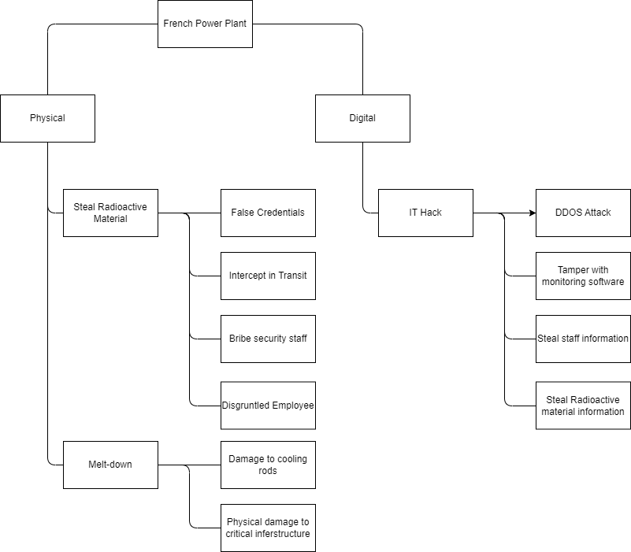

# Threat Modelling Exercise
## Brief
Read Shostack (2018) chapters 3 – 5 (that cover STRIDE and DREAD, Attack Trees and Attack libraries) as well as Spring et al (2021) (that discusses the history and some failings with CVSS) and then create a threat model based on one of the following scenarios:

1. A large international airport based in the United States of America.
2. A large international bank based in the UK.
3. A large nuclear power station in France.

You should use the Threat modelling Manifesto, the OWASP Threat modelling Cookbook and the ATT&CK libraries to inform your model design.

## Chosen scenario
**A large nuclear power station in France**

