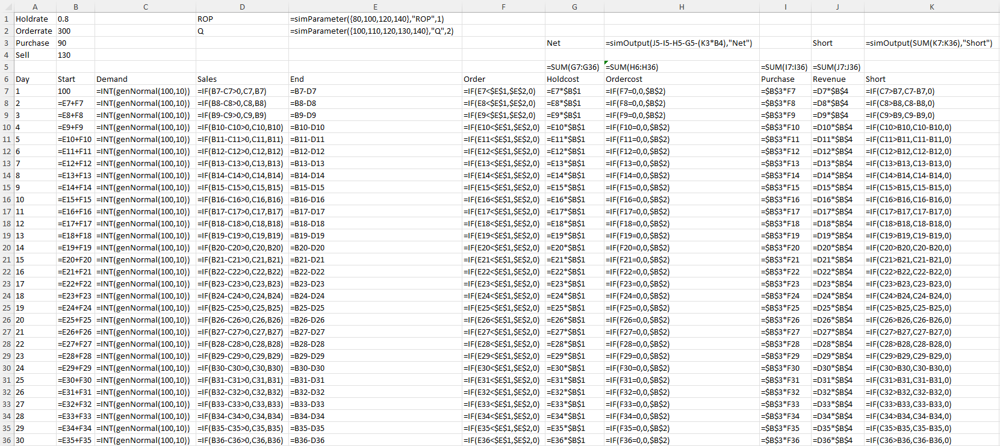
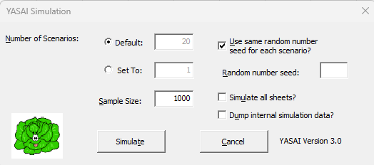
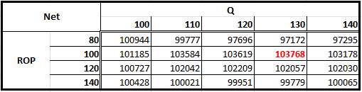

[Back to SRM Module](../README.md)

# Quantitative Risk Modelling

## Activity
> Read chapter 5 of the course text Olsen & Desheng (2020)[^1] and implement the inventory Monte Carlo simulation. You can use Yasai (Eckstein & Riedmuller, 2002) to replace crystal ball.

### Input 
1. YASAI was installed following the [user guide.](https://sites.rutgers.edu/yasai/)
2. Recreate the spreadsheet in Fig. 5.1 in [^1].
3. Replace Cell E1 with `=simParameter({80,100,120,140},"ROP",1)`
4. Replace Cell E2 with `=simParameter({100,110,120,130,140},"Q",2)`
6. Replace Demand Column with `=INT(genNormal(100,10))`
7. Replace Cell H3 with `=simOutput(J5-I5-H5-G5,"Net")`
8. Replace Cell K3 with `=simOutput(SUM(K7:K36),"Short")`
   
   
10. Run YASAI Simulation for all 20 Scenarios for 1000 runs.

    

### Output
The output from YASAI showed that the best highest profits come from a ROP of 100 and a Q of 130:

   

#### [Spreadsheet](./Assets/MC_YASAI.xlsx)

[^1]: Olson, D. and Wu, D. (2020) *Enterprise Risk Management Models*. 3rd Edition. Berlin: Springer Nature. Available via the Vitalsource Bookshelf. [Accessed 26 May 2024]. [DOI: https://doi.org/10.1007/978-3-662-60608-7_5](https://doi.org/10.1007/978-3-662-60608-7_5)
